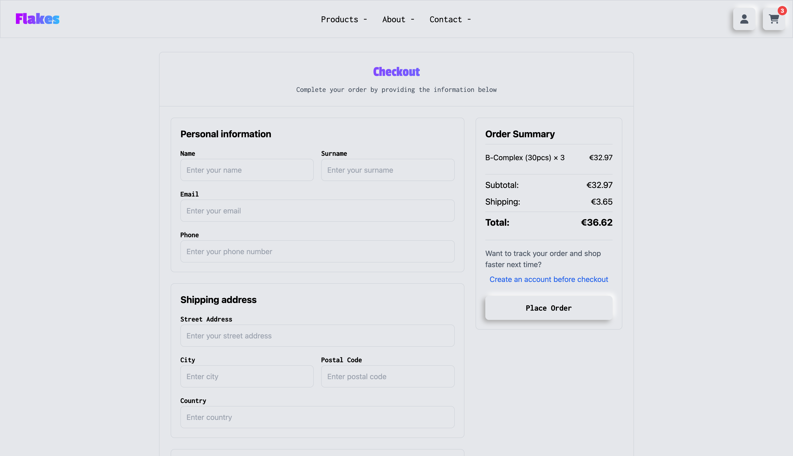

# Flakes

School project for the course **"Web Technologies"** at **FIIT STU**. The goal of the project is to create an **e-shop** focused on **healthcare products**, such as **minerals, vitamins, and essential oils**, using **HTML, CSS, and JavaScript** for the frontend and **PHP Laravel** for the backend.
Most of the images used in project being generated with help of AI and Figma.

---

## Table of Contents

- [Assignment](#assignment)
- [Overview](#overview)
- [Documentation](#documentation)
    - [Physical Data Model](#physical-data-model)
    - [Design Decisions](#design-decisions)
    - [Programming Environment](#programming-environment)
    - [Implementation Details](#implementation-details)
    - [Screenshots](#screenshots)
- [Design](#design)
    - [Lo-Fi Wireframes](#lo-fi-wireframes)
    - [Hi-Fi Prototypes](#hi-fi-prototypes)
- [Features](#features)
- [Installation](#installation)
- [Technologies Used](#technologies-used)
- [Authors](#authors)

---

## Assignment

### Original Assignment (Slovak)
Vytvorte webovú aplikáciu - eshop, ktorá komplexne rieši nižšie definované prípady použitia vo vami zvolenej doméne (napr. elektro, oblečenie, obuv, nábytok). Presný rozsah a konkretizáciu prípadov použitia si dohodnete s vašim vyučujúcim.

### Assignment (English)
Create a web application - an e-shop that comprehensively addresses the use cases defined below in your chosen domain (e.g., electronics, clothing, footwear, furniture). The exact scope and specification of use cases will be agreed upon with your instructor.

## Overview

Flakes is a **health-focused e-commerce website** where users can browse **wellness products**, add items to their cart, and place orders. The project is divided into two main parts:
1. **Frontend:** Built with **HTML, CSS, and JavaScript**.
2. **Backend:** Developed with **PHP Laravel**, handling user authentication, cart functionality, and order processing.

---

## Documentation

### Physical Data Model

The physical data model includes tables for users, products, categories, orders, carts, and related entities. Since the second phase, several modifications were made:

<div align="center">
  
</div>

**Changes from Phase 2:**
- Added `is_admin` column to users table to distinguish between regular users and administrators
- Modified `orders` table to support guest checkout with `guest_name`, `guest_email`, and `guest_phone` columns and added `price` to track final order price


### Design Decisions

1. **Authentication System:**
    - Used Laravel's built-in authentication scaffolding
    - Implemented simple role management with boolean `is_admin` flag instead of complex role system
    - Decision rationale: Sufficient for small e-shop with only two user types (regular users and admins)

2. **Cart Management:**
    - Dual implementation: localStorage for guests and database for authenticated users
    - Created custom CartManager.js to handle both scenarios
    - Automatic cart synchronization upon login

3. **External Libraries:**
    - **Tailwind CSS:** For rapid UI development with utility-first approach (installed via npm)
    - **Alpine.js:** For lightweight JavaScript interactivity
    - **Chart.js (via CDN):** For admin dashboard visualizations
    - **Font Awesome:** For consistent iconography
    - **Axios:** For making HTTP requests in JavaScript
    - **Vite:** For modern frontend build tooling and hot module replacement
    - **Laravel Vite Plugin:** For integrating Vite with Laravel
    - **PostCSS & Autoprefixer:** For processing CSS with browser compatibility

4. **Guest Checkout:**
    - Implemented guest checkout functionality without requiring registration
    - Guest orders stored with contact information directly in orders table
    - Decision: Reduces friction in purchasing process

### Programming Environment

- **Backend:** PHP 8.2 with Laravel 11.x
- **Frontend:** Vanilla JavaScript with CDN libraries
- **Database:** PostgreSQL
- **Development Tools:**
    - Composer for PHP dependencies
    - Laravel's built-in server for development
    - No build process required (CDN approach)

### Implementation Details

#### 1. Product Quantity Management
```php
public function update(Request $request)
{
    $validated = $request->validate([
        'item_id' => 'required|string',
        'quantity' => 'required|integer|min:1'
    ]);
    
    // Update quantity in database
    $cartItem = CartItem::where('user_id', Auth::id())
        ->where('id', $itemId)
        ->firstOrFail();
    
    $cartItem->quantity = $quantity;
    $cartItem->save();
}
```

#### 2. User Authentication
```php
Route::middleware(['auth'])->prefix('admin')->group(function () {
    Route::get('/', function (Request $request) {
        if (!auth()->user()->is_admin) {
            return redirect('/')->with('error', 'You do not have admin access.');
        }
        return app(AdminController::class)->index($request);
    })->name('admin');
});
```

#### 3. Product Search
```php
if ($request->has('search') && !empty($request->search)) {
    $searchTerm = $request->search;
    $query->where(function($q) use ($searchTerm) {
        $q->whereRaw('LOWER(name) LIKE ?', ['%' . strtolower($searchTerm) . '%'])
          ->orWhereRaw('LOWER(description) LIKE ?', ['%' . strtolower($searchTerm) . '%'])
          ->orWhereHas('tags', function($tagQuery) use ($searchTerm) {
              $tagQuery->whereRaw('LOWER(tag_name) LIKE ?', ['%' . strtolower($searchTerm) . '%']);
          });
    });
}
```

#### 4. Add to Cart
```javascript
async addToCart(packageId, quantity) {
    try {
        const response = await fetch('/cart/add', {
            method: 'POST',
            headers: {
                'Content-Type': 'application/json',
                'X-CSRF-TOKEN': this.csrfToken
            },
            body: JSON.stringify({
                package_id: packageId,
                quantity: quantity
            })
        });
        
        if (!response.ok) throw new Error('Failed to add item to cart');
        
        const data = await response.json();
        this.updateCartCountDisplay(data.cart_count);
        
        return { success: true, message: data.message };
    } catch (error) {
        console.error('Error adding to cart:', error);
        return { success: false, message: 'Failed to add item to cart' };
    }
}
```

#### 5. Pagination
```php
$products = $query->paginate(12);
return view('products', compact('products', 'availableTags', 'availablePackages', 'minPrice', 'maxPrice'));
```

#### 6. Basic Filtering
```php
// Apply category filter
if ($request->has('category') && $request->category != 'all') {
    $query->where('category', $request->category);
}

// Apply price range filter
if ($request->has('min_price') || $request->has('max_price')) {
    $minPriceFilter = $request->min_price ?? $minPrice;
    $maxPriceFilter = $request->max_price ?? $maxPrice;
    
    $query->whereHas('packages', function ($q) use ($minPriceFilter, $maxPriceFilter) {
        $q->where('price', '>=', $minPriceFilter)
          ->where('price', '<=', $maxPriceFilter);
    });
}
```

### Screenshots

#### Homepage


#### Products 


#### Product Detail


#### Shopping Cart


#### Checkout Page


#### Profile Page


#### Login Page


#### Register Page


### Admin Page


---

## Design


### Lo-Fi Wireframes
Lo-fi wireframes were created to outline the structure and layout of the e-shop. These designs serve as the foundation for the hi-fi prototypes.
Lo-fi wireframes were created using **Miro**.
<div align="center">
  
</div>

<div align="center">
  
  
</div>

<div align="center">
  
  
</div>

<div align="center">
  
  
</div>

<div align="center">
  
  
</div>


### Hi-Fi Prototypes
Hi-fi prototypes were designed in **Figma**, providing a more detailed representation of the final UI/UX.
This prototype is fully clickable and interactive.
<div align="center">
  
</div>
<div align="center">
  
  
</div>

<div align="center">
  
  
</div>

<div align="center">
  
  
</div>

<div align="center">
  
  
</div>

<div align="center">
  

</div>

---

## Features

- User registration and authentication
- Product browsing and search
- Dynamic filtering and pagination
- Guest and authenticated cart management
- Order placement with or without account
- Admin dashboard with charts, statistics, and product management
- Responsive design for mobile and desktop

---

## Installation

```bash
git clone https://github.com/SamNag/wtech2025_hajko_nagy.git
cd flakes
composer install
npm install
cp .env.example .env
```
Configure your `.env` file with your database credentials:
```
DB_CONNECTION=pgsql
DB_HOST=127.0.0.1
DB_PORT=5432
DB_DATABASE=flakes_db
DB_USERNAME=your_username
DB_PASSWORD=your_password
```
Generate the application key:
```bash
php artisan key:generate
```
Run the migrations and seed the database:
```bash
php artisan migrate --seed
```
Run the Laravel server:
```bash
php artisan serve
```
Run the compiled assets:
```bash
npm run dev
```
---

## Technologies Used

- Laravel 11 (PHP 8.2)
- PostgreSQL
- Tailwind CSS (via CDN)
- Chart.js (via CDN)
- JavaScript, HTML, CSS

---

## Authors

- Samuel Nagy
- Dominik Hajko
